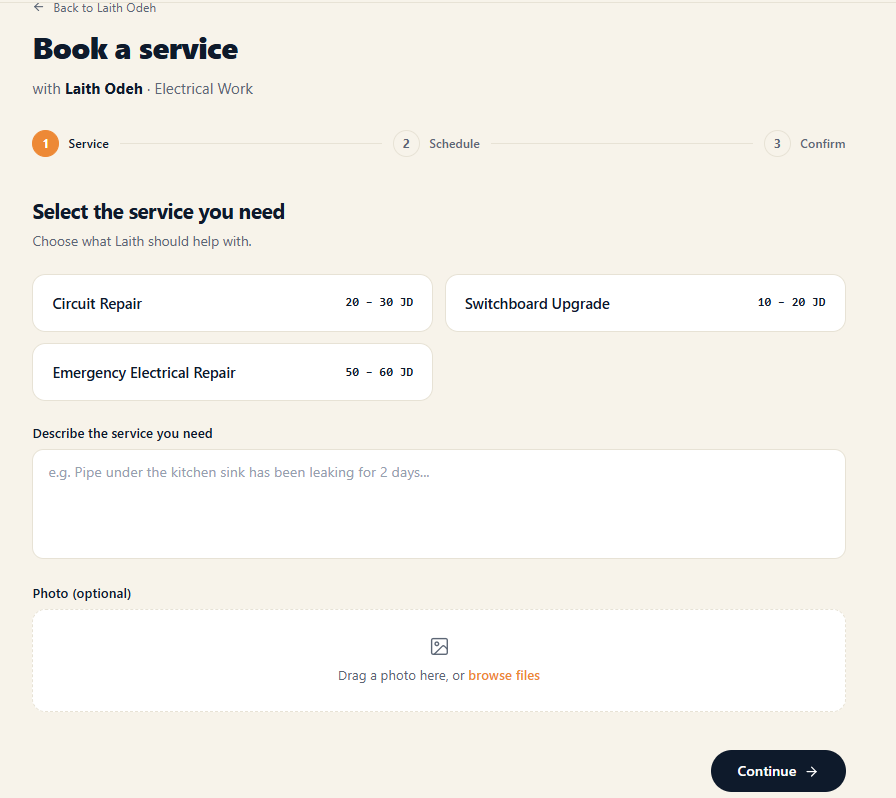

# BookingStep1.tsx

**Path:** `src/components/organisms/createBooking/bookingSteps/BookingStep1.tsx`
**Type:** Component (form step)

## Purpose

Step 1 of the booking wizard: pick a service, write a description, optionally attach a photo.

## Props

| Name            | Type                                  | Description                                        |
| --------------- | ------------------------------------- | -------------------------------------------------- |
| `pro`           | `BookingPro`                          | The professional, including their offered services |
| `formik`        | `FormikProps<BookingFormValues>`      | Form state and validation                          |
| `image`         | `{ uri: string; file: File } \| null` | Currently attached photo                           |
| `selectService` | `(svc: BookingProService) => void`    | Called when a service card is clicked              |
| `addImage`      | `(file: File) => void`                | Called when a file is picked                       |
| `removeImage`   | `() => void`                          | Called when the remove button is clicked           |
| `t`             | `TFunction`                           | Translation function                               |
| `i18n`          | `{ language: string }`                | Used to decide Arabic vs English service names     |

## Returns / Exports

Default export: `BookingStep1(props)`, a React component.

## Key behavior

- Renders a grid of service cards; each shows a computed price string (`"50 – 60 JD"`, `"From 50 JD"`, or a TBD label depending on which of `minPrice`/`maxPrice` are set).
- A controlled `<textarea>` bound to `formik.values.description`, with an inline error shown when touched and invalid.
- A hidden `<input type="file">` triggered by a visible button — swaps to a preview + remove button once an image is attached.

## Dependencies

`lucide-react` icons, `gfx` (still untyped theme styles).

## Tests

`BookingStep1.test.tsx` — 6 tests, using a real `useFormik` instance (not mocked) so typing/blur validation behave correctly. Covers: controlled textarea input, real Yup validation error display, service click passing the correct object, price-format fallback, and file upload/removal.

## Screenshot

