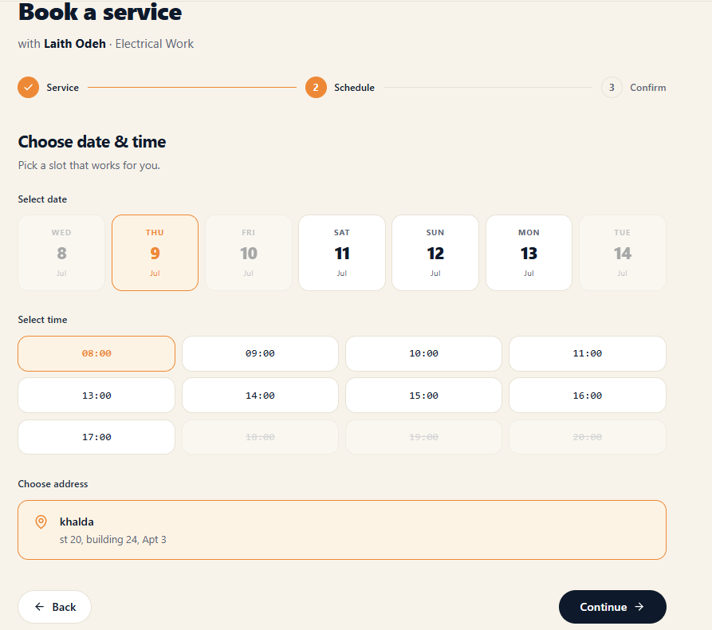

# BookingStep2.tsx

**Path:** `src/components/organisms/createBooking/bookingSteps/BookingStep2.tsx`
**Type:** Component (form step)

## Purpose

Step 2 of the booking wizard: pick a date, pick a time, pick a saved address.

## Props

| Name                | Type                              | Description                                                              |
| ------------------- | --------------------------------- | ------------------------------------------------------------------------ |
| `formik`            | `FormikProps<BookingFormValues>`  | Form state and validation                                                |
| `selectDate`        | `(date: DateSlot) => void`        | Called when a date card is clicked                                       |
| `selectTime`        | `(time: string) => void`          | Called when a time slot is clicked                                       |
| `selectAddress`     | `(address: SavedAddress) => void` | Called when an address card is clicked                                   |
| `savedAddresses`    | `SavedAddress[]`                  | The user's saved addresses                                               |
| `dateSlots`         | `DateSlot[]`                      | Next 7 bookable days                                                     |
| `isDayUnavailable`  | `(date: DateSlot) => boolean`     | Greys out unavailable days                                               |
| `isTimeUnavailable` | `(time: string) => boolean`       | Greys out unavailable times                                              |
| `t`                 | `TFunction`                       | Translation function                                                     |
| `i18n`              | `{ language: string }`            | (currently unused directly in this file, passed through for consistency) |
| `navigate`          | `(path: string) => void`          | Used to send the user to "add an address" if none exist                  |

## Returns / Exports

Default export: `BookingStep2(props)`, a React component.

## Key behavior

- The 7-day grid disables (visually and via `disabled`) any day `isDayUnavailable` flags.
- The time grid only renders once a date is selected; each slot is disabled if `isTimeUnavailable` returns true (shown with a strikethrough).
- The address section shows saved addresses as clickable cards, or a prompt to add one if `savedAddresses` is empty.

## Shared types introduced here

`DateSlot` and `SavedAddress` were pulled into `booking.ts` while converting this file, since their shapes were originally being repeated 2–3 times across this file's prop types.

## Dependencies

`lucide-react` icons, `TIME_SLOTS` constant (still untyped).

## Tests

Not yet tested directly — logic overlaps heavily with what's already tested via `useCreateBooking.test.ts` (`isDayUnavailable`, `isTimeUnavailable`, `selectDate`, `selectAddress`), but this component's own rendering/click-wiring has no dedicated test yet.

## Screenshot

