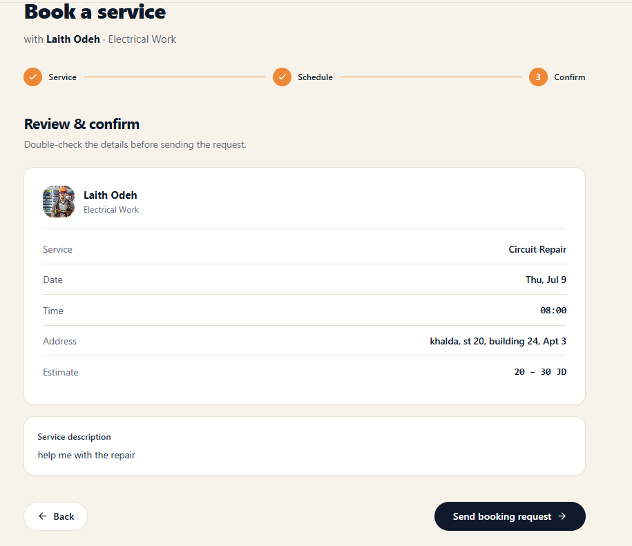

# BookingStep3.tsx

**Path:** `src/components/organisms/createBooking/bookingSteps/BookingStep3.tsx`
**Type:** Component (presentational, read-only)

## Purpose

Step 3 of the booking wizard: a read-only summary of everything chosen in steps 1–2, shown before final submission.

## Props

| Name                | Type                                  | Description                                       |
| ------------------- | ------------------------------------- | ------------------------------------------------- |
| `pro`               | `BookingPro`                          | The professional, shown with avatar/name/category |
| `formik`            | `FormikProps<BookingFormValues>`      | Read-only here — values are displayed, not edited |
| `image`             | `{ uri: string; file: File } \| null` | Shown as a thumbnail if present                   |
| `selectedDateLabel` | `string`                              | Human-readable date, computed in the hook         |
| `t`                 | `TFunction`                           | Translation function                              |

## Returns / Exports

Default export: `BookingStep3(props)`, a React component.

## Key behavior

Builds a `rows` array (service, date, time, address, price) and renders each as a label/value pair. No handlers, no state — purely displays what was already chosen.

## Dependencies

`ProAvatar` (still untyped atom).

## Tests

Not yet tested

## Screenshot

